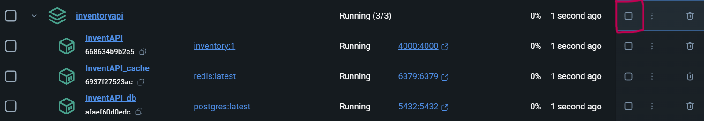

# InventAPI 
**Description**

InventAPI is a REST API developed in Python using the Flask framework. This API is designed to manage product inventory. It supports pagination, product search by quantity, caching with Redis, and data persistence with PostgreSQL. The API is efficient and scalable, using Docker containers for easier deployment and testing.

## 🔨 Features
- Product CRUD operations
- Product search by quantity with pagination support
- Caching with Redis to optimize queries
- Data persistence using PostgreSQL
- Automatic API documentation with Swagger

## 🧑‍💻 Prerequisites
- Have Docker and Docker Compose installed on your machine.
- Have Python 3.6+ (or newer) installed if you want to run the API outside Docker containers. (advisable)
- Windows PowerShell or Git Bash to run commands in a terminal.
- Windows 10 or 11 installed on your computer

## How to install Docker (on Windows) 🪟
- Download Docker Desktop from [here](https://www.docker.com/products/docker-desktop/)
- Follow the installation instructions and ensure Docker is running correctly (you can verify this from the system tray).

> Docker Compose comes pre-installed with Docker Desktop.

## 🚧 Installation and Setup 
1.- Clone the repository
```sh
git clone https://github.com/BriXelDev/InventAPI.git
```
(or download the ZIP file and extract it elsewhere)

2.- Build and run Docker containers

If it is your first time using InventAPI, ensure that you are in the project root directory, then execute:

	docker-compose build
	docker-compose up


>Note: Make sure to have ports 4000, 5432 and 6379 free in order to ensure that InventAPI runs smoothly

This will launch three containers:

- **InventAPI**:  The main API, running on port 4000
- **InventAPI_db** : The API database, running on port 5432
- **InventAPI_cache**: The API cache manager, running on port 6379

Once all the containers are running, open your web browser and navigate to:

http://localhost:4000/apidocs

And *voilá*, InventAPI is now ready to use!
<br></br>

3.- Stop the containers

When you are done, you can stop the containers either with:
- **Docker Desktop**
	- Open Docker Desktop, and click on the stop button on the primary container
	

- **Using the console**
  - In the same root directory of the API, press *Ctrl + C*, then wait for the containers to stop

>Don´t worry about saving changes, InventAPI automatically saves your changes using volumes to keep persistance in the database ;)

<br></br>
**The next time you need to use InventAPI again, you can either run in the root directory of InventoryAPI**:
````
docker compose up
````
**Or you can open Docker Desktop and press the start button on the main container in Docker Desktop:**


## 🖱️ Usage
**Main Endpoints**
- Get all products

- Get products by quantity

- Create a new product

- Update a product

- Delete a product:

- Get a product by SKU

- Patch a product

### Environment Variables
The docker-compose.yml file already includes environment variables for connecting to PostgreSQL and Redis. You can modify these values if needed


## 💠 Technologies Used
- Flask - Framework to build the API
- PostgreSQL - Database to store product information
- Redis - Caching system
- Docker - Containers for the API, database, and Redis
- Swagger - Auto-generated API documentation

## About Contributions
Contributions are welcome! If you have any improvements, feel free to open an issue or a pull request in the repository 😄
<br></br>
<br></br>

# InventAPI (Español)

**Descripción**

InventAPI es una REST API desarrollada en Python utilizando el framework Flask. <br></br>Esta API se encarga de gestionar el inventario de productos. Implementa paginación, búsqueda por cantidad, almacenamiento en caché con Redis y persistencia de datos en PostgreSQL. La API está diseñada para ser eficiente y escalable, utilizando contenedores Docker para facilitar su despliegue y pruebas.

## 🔨 Características

- CRUD de productos
- Búsqueda de productos por cantidad con soporte de paginación
- Almacenamiento en caché con Redis para optimizar consultas
- Persistencia de datos utilizando PostgreSQL
- Documentación automática de API con Swagger

## 👨‍💻 Requisitos previos

- Tener Docker instalado en tu máquina.
- Tener Python 3.6+ (o más reciente) instalado si deseas ejecutar la API fuera de contenedores Docker. (recomendable)
- Windows PowerShell o Git Bash para ejecutar los comandos en una terminal.
- Windows 10 u 11 instalado en tu computadora

## Instrucciones para instalar Docker (en Windows) 🪟

1. Descarga Docker Desktop desde [aqui](https://www.docker.com/products/docker-desktop/)

2. Sigue las instrucciones del instalador y asegúrate de que Docker esté corriendo correctamente (puedes verificar en la bandeja del sistema).

>Docker Compose ya viene instalado junto con Docker Desktop

## 🚧 Instalación y ejecución

1.- Clona este repositorio en tu máquina local:
```sh
git clone https://github.com/Zorex55/Proyectos.git
```
(o descarga el archivo ZIP y extráelo en otro lugar)

2.- Construir y ejecutar los contenedores Docker

Si es la primera vez que usas InventAPI, asegúrate de estar en el directorio raíz del proyecto y luego ejecuta:
```
docker-compose build
docker-compose up
```
>Nota: Asegúrate de tener los puertos 4000, 5432 y 6371 libres para que InventAPI funcione bien

Esto levantará tres contenedores:

- **InventAPI**: La interfaz principal de la API, corriendo en el puerto 4000
- **InventAPI_db**: La base de datos de la API, corriendo en el puerto 5432
- **InventAPI_cache**: El administrador de caché de la API, corriendo en el puerto 6371

Una vez que los contenedores estén levantados y corriendo, abre tu navegador web y ve a:

http://localhost:4000/apidocs

Y *voilá*, ¡InventAPI estará lista para usarse!
<br></br>

3.- Parar los contenedores

Una vez que hayas terminado, puedes detener los contenedores ya sea:
- **Usando Docker Desktop**:
  - Abre Docker Desktop, y haz clic en boton "Detener" en el contenedor principal
  

- **Usando la consola**:
  - En la misma carpeta raíz de la API, oprime *Ctrl + C* y espera a que los contenedores se detengan
  - 
>No te preocupes por guardar los cambios. InventAPI guarda los cambios en automático usando volúmenes para mantener la persistencia en la base de datos ;)

<br></br>
**La siguiente vez que necesites usar InventAPI, puedes ejecutar este comando en el directorio raíz de InventoryAPI**:
````
docker compose up
````
**O puedes hacer clic en el botón de inicio del contenedor principal en Docker Desktop:**


## 🖱️ Usos
**Endpoints principales**
- Obtener todos los productos

- Obtener productos por cantidad

- Crear un nuevo producto

- Actualizar algún producto

- Eliminar un producto

- Obtener un producto con base a su SKU

- Actualizar partes de un producto

### Variables de entorno
El archivo ocker-compose.yml ya contiene variables de entorno para poder conectarse a PostgreSQL y Redis. Puedes modificar los valores si así lo requieres


## 💠 Tecnologías usadas
- Flask - Framework que construye la API
- PostgreSQL - Base de datos que guarda toda la información de los productos
- Redis - Sistema de caché
- Docker - Contenedores para la API, Postgre y Redis
- Swagger - Documentación auto generada para la API

## Sobre contribuciones
¡Las contribuciones son más que bienvenidas! Si tienes alguna mejora, siéntete libre de abrir un issue o un pull request en el repositorio 😄

>Para la versión en español: Toda la API está en inglés por ahora, se subirá una versión traducida muy pronto
